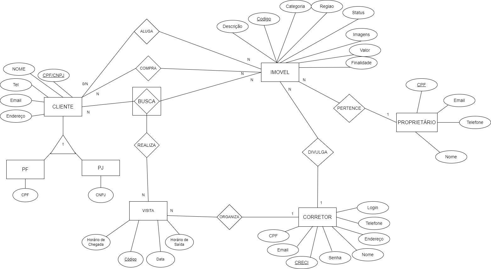
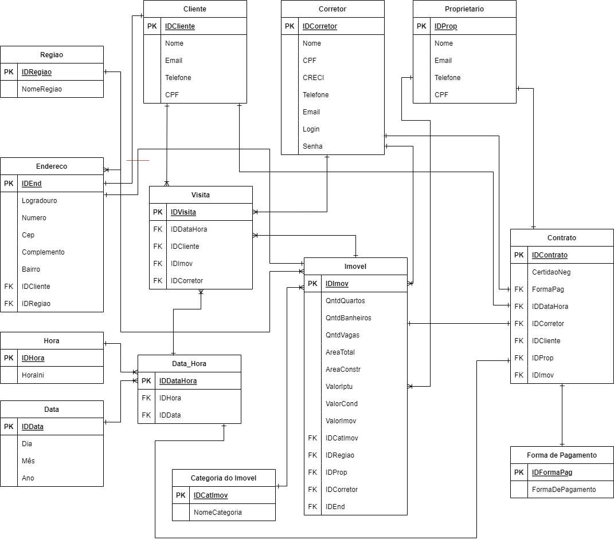

# Capimóveis - Database Report 

Docentes:<br>
* Márcio Rene Brandão Soussa<br>
* Hilton Vicente César

Discentes:<br>
* Bruno Souza<br>
* Daniel Lima<br>
* Henrique Sá<br>
* Mateus Torres                                              
* Roberto Santos <br>

## Descrição do Projeto
O Portal Imobiliário é um sistema cujo principal objetivo é a divulgação facilitada e eficaz dos imóveis na web, sendo o cadastramento destes imóveis, feito por um corretor inscrito na plataforma.
O site permite a visualização de todos os imóveis cadastrados, para que o cliente interessado possa entrar em contato com o corretor através de um formulário de contato ou até mesmo pelos meios de comunicação disponíveis.
É possível, filtrar os tipos de imóveis desejados, como apenas casas, apartamentos, loteamentos, quantidade de quartos, dentre suas outras características, assim como definir um limite de valor máximo. Dessa forma o cliente consegue ser mais ágil na sua busca e encontrar o seu imóvel ideal.
Para o desenvolvimento do front-end foi utilizado o framework Next.js porém, com alteração de Javascript para  Typescript, alinhado ao framework de estilização TailwindCSS. Assim como, para o back-end foi utilizado o framework Spring Boot juntamente com a linguagem Java para construção da API desenvolvida.

## Modelo Conceitual de Dados
Modelo conceitual de dados referente à primeira versão do banco de dados do portal imobiliário. Sendo possível uma maior noção acerca do que acontece nos bastidores da empresa e do sistema, feito no software Draw io.

</img>

## Modelo Relacional Normalizado

Nesta seção, busca-se apresentar o modelo relacional normalizado de dados referente ao banco de dados do portal imobiliário, a equipe de desenvolvimento do projeto optou por utilizar o recurso de chaves artificiais, com o intuito de melhor aproveitamento futuro, caso ocorra alguma alteração e necessite de manutenções. Sendo possível uma maior noção acerca do que acontece nos bastidores da empresa e do sistema.

</img>

## Dicionário de Dados

#### <b>Tabela Cliente </b> - Tabela que recebe os dados de um potencial cliente.

* <b> id_cliente  </b> - Chave primária da tabela, identificador.
* <b> nome  </b> - Nome do cliente.
* <b> email </b> - Email pessoal do cliente.
* <b> telefone </b> - Telefone pessoal do cliente.
* <b> cpf </b> - Documento de Cadastro de Pessoa Física do cliente. 

#### <b>Tabela Região </b> - Tabela que recebe os dados da região do imóvel.

* <b> id_regiao </b> - Chave primária da tabela, identificador.
* <b> nome_regiao </b> - Nome da região.

#### <b>Tabela Endereços </b> - Tabela que recebe os dados gerais de endereço.

* <b> id_end </b> - Chave primária da tabela, identificador.
* <b> logradouro </b> - Rua, Avenida ou Travessa.
* <b> numero </b> - Chave primária da tabela, identificador.
* <b> cep </b> - Número de identificação do imóvel na cidade (código de endereçamento postal).
* <b> complemento </b> - Complemento/pontos de referências do endereço do imóvel.
* <b> bairro </b> - Nome do bairro da cidade que o imóvel está localizado.
* <b> id_cliente </b> - Chave estrangeira, que representa a tabela Cliente.
* <b> id_regiao </b> - Chave estrangeira, que representa a tabela Região.

#### <b>Tabela Corretor </b> - Tabela que recebe os dados de um corretor.

* <b> id_corretor  </b> - Chave primária da tabela, identificador.
* <b> nome  </b> - Nome do corretor.
* <b> email </b> - Email do corretor.
* <b> telefone </b> - Telefone profissional do corretor.
* <b> cpf </b> - Documento de Cadastro de Pessoa Física do cliente.
* <b> creci </b> - Documento do Conselho Regional de Corretores de Imóveis.
* <b> login </b> - Nome de usuário do corretor .
* <b> senha </b> - Senha do usuário do corretor.

#### <b>Tabela Proprietário </b> - Tabela que recebe os dados do proprietário do imóvel.

* <b> id_prop  </b> - Chave primária da tabela, identificador.
* <b> nome  </b> - Nome do proprietário.
* <b> email </b> - Email pessoal do propr.
* <b> telefone </b> - Telefone pessoal do cliente.
* <b> cpf </b> - Documento de Cadastro de Pessoa Física do proprietário. 

#### <b>Tabela Categoria do Imóvel </b> - Tabela que recebe os dados do proprietário do imóvel.

* <b> id_catimov  </b> - Chave primária da tabela, identificador.
* <b> nome_cat  </b> - Categoria a qual o imóvel pertence.

#### <b>Tabela Imagens </b> - Tabela que armazena o endereço das imagens dos imóveis.

* <b> id_img  </b> - Chave primária da tabela, identificador.
* <b> end_img  </b> - Endereço da imagem no sistema da empresa.

#### <b>Tabela Galeria </b> - Tabela que representa as diferentes galerias de imagens do sistema.

* <b> id_galeria  </b> - Chave primária da tabela, identificador.
* <b> nome_gal  </b> - Nome da galeria.

#### <b>Tabela Fotos Imóvel </b> - Tabela associativa das fotos dos imóveis.

* <b> id_fts_imov  </b> - Chave primária da tabela, identificador.
* <b> id_galeria  </b> - Chave estrangeira, referente à galeria.
* <b> id_img  </b> - Chave estrangeira, referente à imagem

#### <b>Tabela Imóvel </b> - Tabela que armazena os dados do imovel.
* <b> id_imov </b> - Chave primária, que garante a unicidade da entidade imóvel.
* <b> dt_cadastro</b> - Data de cadastramento do imóvel.
* <b> quartos</b> - Quantidade de quartos que o imovel possui.
* <b> banheiros</b> - Quantidade de banheiros que o imovel possui.
* <b> vagas</b> - Quantidade de vagas(estacionamento) que o imovel possui.
* <b> area_total</b> - Área do terreno em metros quadrados.
* <b> area_constr</b> - Área do imóvel em metros quadrados.
* <b> valor_iptu</b> - Valor do imposto (Imposto Predial e Territorial Urbano).
* <b> valor_cond</b> - Valor da taxa de condomínio do imóvel.
* <b> valorimov</b> - Valor do imovél, para aluguel ou compra.
* <b> id_fts_imov</b> - Chave estrangeira, que representa a tabela Fotos Imóvel.
* <b> id_catimov</b> - Chave estrangeira, que representa a tabela Categoria do Imovel.
* <b> id_regiao</b> - Chave estrangeira, que representa a tabela Regiao.
* <b> id_prop</b> - Chave estrangeira, que representa a tabela Proprietario.
* <b> id_end</b> - Chave estrangeira, que representa a tabela Endereco.

#### <b>Tabela Visitas</b> - Registra dados sobre visitas ao respectivo imóvel.

* <b> id_visita  </b> - Chave primária da tabela, identificador.
* <b> dt_visita </b> - Data da visita.
* <b> id_ciente </b> - Chave estrangeira, que representa o cliente.
* <b> id_imov </b> - Chave estrangeira, que representa o imóvel.
* <b> id_corretor </b> - Chave estrangeira, que representa o corretor.

#### <b>Tabela Forma de Pagamento</b> - Identifica forma de pagamento utilizada na compra.

* <b> id_formapag  </b> - Chave primária da tabela, identificador.
* <b> forma_pag </b> - Forma de pagamento.

#### <b>Tabela Contrato</b> - Tabela que exibe informações sobre compras de imóveis.

* <b> id_contrato  </b> - Chave primária da tabela, identificador.
* <b> certidao_neg </b> - Certidão negativa, para saber se o imovel tem dívida.
* <b> dt_contrato - </b> - Data em que a compra foi efetivada.
* <b> id_formapag </b> - Chave estrangeira, que representa Forma de Pagamento.
* <b> id_corretor </b> - Chave estrangeira, que representa o corretor.
* <b> id_cliente </b> - Chave estrangeira, que representa o cliente.
* <b> id_imov </b> - Chave estrangeira, que representa o imóvel.


#### <b>Tabela Comissão</b> - Tabela que exibe as comissões dos corretores.

* <b> id_comissao  </b> - Chave primária da tabela, identificador.
* <b> id_corretor  </b> - Chave estrangeira, que representa o identificador do corretor.
* <b> valor_comissao </b> - Valor da comissão do proprietário.
* <b> dt_comissao </b> - Data que a comissão foi gerada.

## Detalhamento Técnico

Para a realização deste projeto, a equipe desenvolvedora decidiu, anteriormente, utilizar o Sistema Gerenciador de Banco de Dados (SGBD) da empresa Oracle, do tipo relacional, sendo o SGBD que a equipe tem um maior domínio técnico, assim como o orientador, facilitando sanar dúvidas provenientes da implementação. Porém, devido à falta de compatibilidade com algumas máquinas dos integrantes da equipe, todo o sistema foi migrado para o PostgreSql, na sua versão 15.
Com o intuito de melhorar o desempenho e a organização do Banco de Dados, devido ao grande volume de dados e a constância de acesso, a tabela “imovel” ficará em uma tablespace separada, assim como a tabela “contrato”, já que essas informações são de suma importância. 
Foi definido que o tamanho ideal para os blocos de discos sejam de 16k, pelo fato da existências de tabelas com grande quantidade de dados. Como algumas características dos imóveis podem ser alteradas, aumentando ou não o tamanho das linhas afetadas, ficará reservado um PCTFREE de 20%, deixando livre, portanto, 80% para o preenchimento do Bloco de Disco.

## Regras de Negócio

A partir do desenvolvimento do projeto, foi solicitado pelo orientador, que desenvolvessemos algumas regras de negócios, as quais se referem às execuções automáticas do sistema. São elas:

1) Deletar automaticamente tudo relacionado ao corretor caso ele seja excluído do sistema.
2) Autualizar automaticamente o proprietário após a compra de algum imóvel, representado pela inserção da tupla de contrato.

# Scripts
## DDL
> Desenvolvido originalmente em OracleSql e migrado para PostgreSql.

#### Tabela de Clientes

|tb_cliente|  
|----|
|id_cliente (pk)|
|nome|
|email|
|telefone|
|cpf|

```   sql
create table tb_cliente (
    id_cliente  serial,
    nome        varchar(30) not null, 
    email       varchar(30) not null UNIQUE, 
    telefone    varchar(15) not null UNIQUE, 
    cpf         varchar(14) not null UNIQUE,

    PRIMARY KEY(id_cliente)
);
```

#### Tabela de Região

|tb_regiao|
|---------|
|id_regiao (pk)|
|nome_regiao|

```    sql
create table tb_regiao ( 
    id_regiao   serial, 
    nome_regiao varchar(25) not null,

    PRIMARY KEY(id_regiao) 
);
```
#### Tabela de Endereços

|tb_endereco|
|-----------|
|id_end (pk)|
|logradouro|
|numero|
|cep|
|complemento|
|bairro|
|id_cliente (fk)|
|id_regiao (fk)|

```    sql
create table tb_endereco ( 
    id_end      serial, 
    logradouro  varchar(40) not null, 
    numero      varchar(5) not null, 
    cep         varchar(9) not null, 
    complemento varchar(20) not null, 
    bairro      varchar(30) not null, 
    id_cliente  int , 
    id_regiao   int not null,

    PRIMARY KEY(id_end),
    CONSTRAINT fk_end_cliente FOREIGN KEY(id_cliente) REFERENCES tb_cliente(id_cliente),
    CONSTRAINT fk_end_regiao FOREIGN KEY(id_regiao) REFERENCES tb_regiao(id_regiao)
);
```

#### Tabela de Corretores

|tb_corretor|
|-----------|
|id_corretor (pk)|
|nome|
|email|
|telefone|
|cpf|
|creci|
|login|
|senha|


```    sql
create table tb_corretor (
    id_corretor serial,
    nome        varchar(40) not null,
    email       varchar(40) not null UNIQUE,
    telefone    varchar(15) not null,
    cpf         varchar(14) not null UNIQUE,
    creci       int not null UNIQUE,
    login       varchar(40) not null UNIQUE,
    senha       varchar(30) not null, 

    PRIMARY KEY(id_corretor)
);
```

#### Tabela de proprietários

|tb_proprietario|
|-----------|
|id_prop (pk)|
|nome|
|email|
|telefone|
|cpf|


```    sql
create table tb_proprietario (
    id_prop     serial,
    nome        varchar(40) not null,
    email       varchar(40) not null UNIQUE,
    telefone    varchar(15) not null,
    cpf         varchar(14) not null UNIQUE,

    PRIMARY KEY(id_prop)
);
```

#### Tabela de Categoria dos Imóveis

|tb_cat_imov|
|-----------|
|id_catimov (pk)|
|nome_cat|


```    sql
create table tb_cat_imov (
    id_catimov serial,
    nome_cat   varchar(40) not null,

    PRIMARY KEY(id_catimov)
);
```

#### Tabela de Imagens

|tb_imagens|
|-----------|
|id_img (pk)|
|end_img|


```    sql
create table tb_imagens (
    id_img serial,
    end_img  bytea,

    PRIMARY KEY(id_img)
);
```

#### Tabela de Galerias

|tb_galeria|
|-----------|
|id_galeria (pk)|
|nome_gal|


```    sql
create table tb_galeria (
    id_galeria serial,
    nome_gal   varchar(40) not null UNIQUE,

    PRIMARY KEY(id_galeria)
);
```

#### Tabela Associativa Imagens-Galeria

|tb_fts_imov|
|-----------|
|id_fts_imov (pk)|
|id_galeria (fk)|
|id_img (fk)|


```    sql
create table tb_fts_imov (
    id_fts_imov serial,
    id_galeria  int not null,
    id_img      int not null,

    PRIMARY KEY(id_fts_imov),
    CONSTRAINT fk_fts_imov_galeria FOREIGN KEY(id_galeria) REFERENCES tb_galeria(id_galeria),
    CONSTRAINT fk_fts_imov_img FOREIGN KEY(id_img) REFERENCES tb_imagens(id_img)
);
```

#### Tabela Imoveis

|tb_imovel|
|-----------|
|id_imov (pk)|
|dt_cadastro|
|quartos|
|banheiros|
|vagas|
|area_total|
|area_constr|
|valor_iptu|
|valor_cond|
|valor_imov|
|id_fts_imov (fk)|
|id_catimov (fk)|
|id_regiao (fk)|
|id_prop (fk)|
|id_end (fk)|


```    sql
create table tb_imovel ( 
    id_imov     serial, 
    dt_cadastro date not null check(dt_cadastro >= CURRENT_DATE), 
    quartos     int not null, 
    banheiros   int not null, 
    vagas       int not null, 
    area_total  int not null, 
    area_constr int not null, 
    valor_iptu  numeric(9,2) not null, 
    valor_cond  numeric(9,2) not null, 
    valor_imov  numeric(9,2) not null, 
    id_fts_imov int not null, 
    id_catimov  int not null, 
    id_regiao   int not null, 
    id_prop     int not null, 
    id_end      int not null,

    PRIMARY KEY(id_imov),
    CONSTRAINT fk_imov_fts_imov FOREIGN KEY(id_fts_imov) REFERENCES tb_fts_imov(id_fts_imov),
    CONSTRAINT fk_imov_cat_imov FOREIGN KEY(id_catimov) REFERENCES tb_cat_imov(id_catimov),
    CONSTRAINT fk_imov_regiao FOREIGN KEY(id_regiao) REFERENCES tb_regiao(id_regiao),
    CONSTRAINT fk_imov_prop FOREIGN KEY(id_prop) REFERENCES tb_proprietario(id_prop),
    CONSTRAINT fk_imov_end FOREIGN KEY(id_end) REFERENCES tb_endereco(id_end)
);
```

#### Tabela Visitas

|tb_visita|
|-----------|
|id_visita (pk)|
|dt_visita|
|id_cliente (fk)|
|id_imov (fk)|
|id_corretor (fk)|


```    sql
create table tb_visita ( 
    id_visita   serial, 
    dt_visita   date not null check(dt_visita >= CURRENT_DATE), 
    id_cliente  int, 
    id_imov     int, 
    id_corretor int,

    PRIMARY KEY(id_visita),
    CONSTRAINT fk_visita_cliente FOREIGN KEY(id_cliente) REFERENCES tb_cliente(id_cliente);
    CONSTRAINT fk_visita_imov FOREIGN KEY(id_imov) REFERENCES tb_imovel(id_imov),
    CONSTRAINT fk_visita_corretor FOREIGN KEY(id_corretor) REFERENCES tb_corretor(id_corretor) 
);
```
#### Tabela Forma de Pagamento

|tb_forma_pagamento|
|-----------|
|id_formapag (pk)|
|forma_pag|


```    sql
create table tb_forma_pagamento ( 
    id_formapag serial, 
    forma_pag   varchar(20) not null check(forma_pag in ('A VISTA', 'PARCELADO')),

    PRIMARY KEY(id_formapag)
);  
```

#### Tabela Contrato

|tb_contrato|
|-----------|
|id_contrato (pk)|
|certidao_neg|
|dt_contrato|
|id_formapag (fk)|
|id_corretor (fk)|
|id_cliente (fk)|
|id_imov (fk)|


```    sql
create table tb_contrato ( 
    id_contrato     serial, 
    certidao_neg    char(1) not null check(certidao_neg in ('V', 'F')), 
    dt_contrato     date not null check(dt_contrato >= CURRENT_DATE), 
    id_formapag     int not null, 
    id_corretor     int not null, 
    id_cliente      int not null, 
    id_imov         int not null,

    PRIMARY KEY(id_contrato),
    CONSTRAINT fk_contrato_formapag FOREIGN KEY(id_formapag) REFERENCES tb_forma_pagamento(id_formapag),
    CONSTRAINT fk_contrato_corretor FOREIGN KEY(id_corretor) REFERENCES tb_corretor(id_corretor),
    CONSTRAINT fk_contrato_cliente FOREIGN KEY(id_cliente) REFERENCES tb_cliente(id_cliente),
    CONSTRAINT fk_contrato_imov FOREIGN KEY(id_imov) REFERENCES tb_imovel(id_imov)
);  
```
#### Tabela Comissao

|tb_comissao|
|-----------|
|id_comisao (pk)|
|id_corretor (fk)|
|valor_comissao|
|dt_comissao|

```    sql
create table tb_comissao (
	id_comissao	serial,
	id_corretor	int,
	valor_comissao	numeric(9,2) not null,
    dt_comissao date not null check(dt_comissao >= CURRENT_DATE),
	
	primary key (id_comissao),
	CONSTRAINT fk_comissao_corretor FOREIGN KEY(id_corretor) REFERENCES tb_corretor(id_corretor) 
); 
```

## Implementação das Regras de Negócio

#### Regra 1

``` sql
create or replace function f_autodelete_corretor() 
returns trigger as $f_autodelete_corretor$
	declare
		vid_corretor int;
	begin
		vid_corretor := OLD.id_corretor;
		
		execute 'delete from tb_visita v where (v.id_corretor = '|| vid_corretor ||')';
		execute 'delete from tb_contrato ct where (ct.id_corretor = '|| vid_corretor ||')';
		
		return new;
	end;
$f_autodelete_corretor$ language plpgsql;

create or replace trigger tr_autodelete_corretor before delete on tb_corretor
	for each row execute function f_autodelete_corretor();
```

#### Regra 2

```sql
create or replace function f_atualiza_proprietario()
returns trigger as $f_atualiza_proprietario$
	declare
		vresultado boolean;
		vid_imov int;
		vid_cliente int;
		vid_proprietario int;
		vid_novo_proprietario integer;
		vreg_cliente tb_cliente%rowtype;
		
		cur_cliente no scroll cursor(key integer) for
													select * from tb_cliente where id_cliente = key;
		cur_prop no scroll cursor(key integer) for
												select id_prop from tb_imovel where id_imov = key;
		cur_novo_prop no scroll cursor(key varchar) for	
													select id_prop from tb_proprietario p where p.cpf = key;
	begin
		vid_imov := NEW.id_imov;
		vid_cliente := NEW.id_cliente;
		
		open cur_cliente(vid_cliente);
		fetch cur_cliente into vreg_cliente;
		close cur_cliente;
		execute 'insert into tb_proprietario(nome, email, telefone, cpf) 
					values('||vreg_cliente.nome||', '||vreg_cliente.email||', '||vreg_cliente.telefone||', '||vreg_cliente.cpf||')';
		
		open cur_prop(vid_imov);
		fetch cur_prop into vid_proprietario;
		close cur_prop;
		
		vresultado := f_verificar_proprietario(vid_proprietario);
		if vresultado then 
			execute 'delete from tb_proprietario p where (p.id_prop = '||vid_proprietario||')';
			raise notice 'Como o proprietario possuia somente o imovel vendido ele foi retirado do sistema.';
		else
			raise notice 'Proprietario possui multiplos imoveis por isso sera mantido no sistema.';
		end if;
		
		open cur_novo_prop(vreg_cliente.cpf);
		fetch cur_novo_prop into vid_novo_proprietario;
		close cur_novo_prop;
		execute 'update tb_imoveis set id_prop = '||vid_novo_proprietario||' where id_prop = '||vid_proprietario;
		
		return new;
	end;
$f_atualiza_proprietario$ language plpgsql;

create or replace trigger tr_atualiza_proprietario after insert on tb_contrato
	for each row execute function f_atualiza_proprietario();
```

#### Função auxiliar da regra 2
```sql
create or replace function f_verificar_proprietario(chave integer) 
returns boolean as $f_verificar_proprietario$
	declare
		vqnt_imov integer;
	begin
		select count(*) into vqnt_imov from tb_imovel i join tb_proprietario p on i.id_prop = chave;
		
		if vqnt_imov <= 1 then
			return true;
		else
			return false;
		end if;
	end;
$f_verificar_proprietario$ language plpgsql;
```
## DML

```sql
--Clientes
INSERT INTO tb_cliente (nome, email, telefone,cpf) values ('Samuel Lago','lagosamuca@gmail.com','(53) 98457-2134','625.487.670-19');
INSERT INTO tb_cliente (nome, email, telefone,cpf) values ('Maria Araujo','mariaaraujo@gmail.com','(82) 99915-8791','520.301.134-34');
INSERT INTO tb_cliente (nome, email, telefone,cpf) values ('Amanda Lopes','amandalopes@gmail.com','(21) 99204-4111','631.857.607-26');
INSERT INTO tb_cliente (nome, email, telefone,cpf) values ('Davi Silva','silvadavi@gmail.com','(91) 98760-2035','358.932.192-74');
INSERT INTO tb_cliente (nome, email, telefone,cpf) values ('Laura Fernandes','laurafernandes@gmail.com','(71) 99741-8208','159.073.325-81');
INSERT INTO tb_cliente (nome, email, telefone,cpf) values ('Gael Rodrigues','gaelrodrigues@gmail.com','(71) 99981-7555','126.570.525-92');

--Regiao
INSERT INTO tb_regiao (nome_regiao) VALUES ('Salvador');
INSERT INTO tb_regiao (nome_regiao) VALUES ('Lauro de Freitas');
INSERT INTO tb_regiao (nome_regiao) VALUES ('Arembepe');
INSERT INTO tb_regiao (nome_regiao) VALUES ('Mata de São João');
INSERT INTO tb_regiao (nome_regiao) VALUES ('Madre de Deus');
INSERT INTO tb_regiao (nome_regiao) VALUES ('São Lourenço do Sul');
INSERT INTO tb_regiao (nome_regiao) VALUES ('Atalaia');
INSERT INTO tb_regiao (nome_regiao) VALUES ('Niterói');
INSERT INTO tb_regiao (nome_regiao) VALUES ('Abaetetuba');

--Endereco Cliente
INSERT INTO tb_endereco (logradouro, numero, cep, complemento, bairro, id_cliente, id_regiao) VALUES ('Distrito São João da Reserva', '45', '96170-978', 'Casa F', 'São João da Reserva', 1, 6);
INSERT INTO tb_endereco (logradouro, numero, cep, complemento, bairro, id_cliente, id_regiao) VALUES ('Avenida Silvestre Péricles', '87', '57690-970', 'Casa A', 'Centro', 2, 7);
INSERT INTO tb_endereco (logradouro, numero, cep, complemento, bairro, id_cliente, id_regiao) VALUES ('Rua Coronel Gomes Machado', '132', '24020-065', 'apto 802', 'Centro', 3, 8);
INSERT INTO tb_endereco (logradouro, numero, cep, complemento, bairro, id_cliente, id_regiao) VALUES ('Rua Siqueira Mendes', '1278', '68440-970', 'Casa C', 'Abaetetuba', 4, 9);
INSERT INTO tb_endereco (logradouro, numero, cep, complemento, bairro, id_cliente, id_regiao) VALUES ('Rua Aracy Grubide', '17', '42700-973', 'Quadra 05', 'Itinga', 5, 2);
INSERT INTO tb_endereco (logradouro, numero, cep, complemento, bairro, id_cliente, id_regiao) VALUES ('Rua Dr. Raimundo Magaldi', '56', '41760-020', 'Apto 303', 'Costa Azul', 6, 1);

--Endereco Imovel
INSERT INTO tb_endereco (logradouro, numero, cep, complemento, bairro, id_cliente, id_regiao) VALUES ('Travessa Jardim América', '144', '41810-320', 'Apto 303', 'Pituba', null, 1);
INSERT INTO tb_endereco (logradouro, numero, cep, complemento, bairro, id_cliente, id_regiao) VALUES ('Rua Manoel Coelho', '85', '42835-971', 'Casa D', 'Centro', null, 3);
INSERT INTO tb_endereco (logradouro, numero, cep, complemento, bairro, id_cliente, id_regiao) VALUES ('Rua São Braz', '55', '40230-725', 'Apt 104', 'Federação', null, 1);
INSERT INTO tb_endereco (logradouro, numero, cep, complemento, bairro, id_cliente, id_regiao) VALUES ('Praça Pedro Gomes', '129', '42600-970', 'Casa A', 'Centro', null, 5);
INSERT INTO tb_endereco (logradouro, numero, cep, complemento, bairro, id_cliente, id_regiao) VALUES ('Rua Santa Helena', '43', '42600-970', 'Casa E', 'Apicum', null, 5);
INSERT INTO tb_endereco (logradouro, numero, cep, complemento, bairro, id_cliente, id_regiao) VALUES ('Avenida Praia de Copacabana', '720', '42707-210', 'Bloco B', 'Vilas do Atlântico', null, 2);
INSERT INTO tb_endereco (logradouro, numero, cep, complemento, bairro, id_cliente, id_regiao) VALUES ('Avenida Brigadeiro Mário Epingaus', '35', '42700-971', 'apto 607', 'Centro', null, 2);
INSERT INTO tb_endereco (logradouro, numero, cep, complemento, bairro, id_cliente, id_regiao) VALUES ('Alameda dos Pescadores', '202', '48280-971', 'Casa C', 'Praia do Forte', null, 4);
INSERT INTO tb_endereco (logradouro, numero, cep, complemento, bairro, id_cliente, id_regiao) VALUES ('Rua da Glória', '32', '42835-971', 'Bloco A', 'Abrantes', null, 3);
INSERT INTO tb_endereco (logradouro, numero, cep, complemento, bairro, id_cliente, id_regiao) VALUES ('Avenida Cardeal da Silva', '220', '40231-250', 'Apto 702', 'Federação', null, 1);

--Corretor
INSERT INTO tb_corretor (nome, email, telefone, cpf, creci, login, senha) VALUES ('Erick Paulo Valansuela', 'erick.paulo@geradornv.com.br', '(69)2210-1607', '564.217.412-66', 152150, 'erick.paulo@geradornv.com.br', 'fkwt5T77MM');
INSERT INTO tb_corretor (nome, email, telefone, cpf, creci, login, senha) VALUES ('Cristiane Paiva Alentejo', 'cristiane@geradornv.com.br', '(94) 3187-1581', '139.646.862-55', 314225, 'cristiane@geradornv.com.br', 'GA9T&HEk_*uy');
INSERT INTO tb_corretor (nome, email, telefone, cpf, creci, login, senha) VALUES ('Viviane Amancio Chiles', 'viviane@geradornv.com.br', '(47)2807-5145', '494.963.239-60', 684168, 'viviane@geradornv.com.br', '7oc9Zk(sqcC7');
INSERT INTO tb_corretor (nome, email, telefone, cpf, creci, login, senha) VALUES ('Mônica Jales Alfradique', 'monica@geradornv.com.br', '(69)2210-1607', '150.077.372-75', 598812, 'monica@geradornv.com.br', 'texugoSocialista090');

--Proprietario
INSERT INTO tb_proprietario (nome, email, telefone, cpf) VALUES ('Gael Juan Duarte', 'gael-duarte91@gmail.com.br', '(71) 98594-9320', '934.596.365-05');
INSERT INTO tb_proprietario (nome, email, telefone, cpf) VALUES ('Maria Isadora Barros', 'maria_barros@gmail.com.br', '(71) 99234-9500', '382.425.175-25');
INSERT INTO tb_proprietario (nome, email, telefone, cpf) VALUES ('Bianca Ayla Clarice Moura', 'bianca_moura@gmail.com.br', '(75) 99982-8246', '541.438.945-48');
INSERT INTO tb_proprietario (nome, email, telefone, cpf) VALUES ('Benício Yuri Duarte', 'benicio.yuri.duarte@gmail.com.br', '(71) 98857-8253', '168.861.585-70');
INSERT INTO tb_proprietario (nome, email, telefone, cpf) VALUES ('Iago Daniel Diogo Ramos', 'iago_ramos@gmail.com.br', '(71) 98110-8879', '777.004.825-78');
INSERT INTO tb_proprietario (nome, email, telefone, cpf) VALUES ('Gabrielly Stella Mariah Mendes', 'gabrielly_stella_mendes@gmail.com.br', '(71) 99352-2072', '255.866.915-07');
INSERT INTO tb_proprietario (nome, email, telefone, cpf) VALUES ('Benjamin Heitor Almada', 'benjamin_heitor_almada@gmail.com.br', '(71) 98539-7836', '258.963.085-90');
INSERT INTO tb_proprietario (nome, email, telefone, cpf) VALUES ('Antonio Theo Nicolas Silveira', 'antonio_silveira@gmail.com.br', '(71) 99278-9128', '983.367.995-16');
INSERT INTO tb_proprietario (nome, email, telefone, cpf) VALUES ('Manuel Daniel Aragão', 'manueldanaragao@gmail.com.br', '(73) 99272-8236', '254.320.085-13');
INSERT INTO tb_proprietario (nome, email, telefone, cpf) VALUES ('Elaine Tatiane Corte Real', 'elaine_tatiane_cortereal@gmail.com.br', '(71) 99979-6169', '800.793.215-18');

--Categoria Imovel
insert into tb_cat_imov (nome_cat) values ('Apartamento');
insert into tb_cat_imov (nome_cat) values ('Casa');
insert into tb_cat_imov (nome_cat) values ('Comercial');
insert into tb_cat_imov (nome_cat) values ('Studio');
insert into tb_cat_imov (nome_cat) values ('Terreno');
insert into tb_cat_imov (nome_cat) values ('Fazenda');

--Imagens
INSERT INTO tb_imagens (end_img) values (bytea('foto'));
INSERT INTO tb_imagens (end_img) values (bytea('foto'));
INSERT INTO tb_imagens (end_img) values (bytea('foto'));
INSERT INTO tb_imagens (end_img) values (bytea('foto'));
INSERT INTO tb_imagens (end_img) values (bytea('foto'));
INSERT INTO tb_imagens (end_img) values (bytea('foto'));
INSERT INTO tb_imagens (end_img) values (bytea('foto'));
INSERT INTO tb_imagens (end_img) values (bytea('foto'));
INSERT INTO tb_imagens (end_img) values (bytea('foto'));
INSERT INTO tb_imagens (end_img) values (bytea('foto'));
INSERT INTO tb_imagens (end_img) values (bytea('foto'));
INSERT INTO tb_imagens (end_img) values (bytea('foto'));
INSERT INTO tb_imagens (end_img) values (bytea('foto'));
INSERT INTO tb_imagens (end_img) values (bytea('foto'));
INSERT INTO tb_imagens (end_img) values (bytea('foto'));
INSERT INTO tb_imagens (end_img) values (bytea('foto'));
INSERT INTO tb_imagens (end_img) values (bytea('foto'));
INSERT INTO tb_imagens (end_img) values (bytea('foto'));
INSERT INTO tb_imagens (end_img) values (bytea('foto'));
INSERT INTO tb_imagens (end_img) values (bytea('foto'));
INSERT INTO tb_imagens (end_img) values (bytea('foto'));
INSERT INTO tb_imagens (end_img) values (bytea('foto'));
INSERT INTO tb_imagens (end_img) values (bytea('foto'));
INSERT INTO tb_imagens (end_img) values (bytea('foto'));
INSERT INTO tb_imagens (end_img) values (bytea('foto'));
INSERT INTO tb_imagens (end_img) values (bytea('foto'));
--Galeria
INSERT INTO tb_galeria (nome_gal) values ('Galeria Apt Pituba');
INSERT INTO tb_galeria (nome_gal) values ('Galeria Casa 1 Centro');
INSERT INTO tb_galeria (nome_gal) values ('Galeria Apt 1 Federação');
INSERT INTO tb_galeria (nome_gal) values ('Galeria Casa 2 Centro');
INSERT INTO tb_galeria (nome_gal) values ('Galeria Apicum');
INSERT INTO tb_galeria (nome_gal) values ('Galeria Casa Vilas');
INSERT INTO tb_galeria (nome_gal) values ('Galeria Apt Centro');
INSERT INTO tb_galeria (nome_gal) values ('Galeria Casa PF');
INSERT INTO tb_galeria (nome_gal) values ('Galeria Terreno Abrantes');
INSERT INTO tb_galeria (nome_gal) values ('Galeria Apt 2 Federação');

-- Fts_imov (ligação da imagem com a sua galeria)
--Apt Pituba
INSERT INTO tb_fts_imov (id_galeria, id_img) values (1, 1);
INSERT INTO tb_fts_imov (id_galeria, id_img) values (1, 2);
INSERT INTO tb_fts_imov (id_galeria, id_img) values (1, 3);
-- Casa 1 Centro
INSERT INTO tb_fts_imov (id_galeria, id_img) values (2, 4);
INSERT INTO tb_fts_imov (id_galeria, id_img) values (2, 5);
-- Apt 1 Federação
INSERT INTO tb_fts_imov (id_galeria, id_img) values (3, 6);
INSERT INTO tb_fts_imov (id_galeria, id_img) values (3, 7);
INSERT INTO tb_fts_imov (id_galeria, id_img) values (3, 8);
INSERT INTO tb_fts_imov (id_galeria, id_img) values (3, 9);
INSERT INTO tb_fts_imov (id_galeria, id_img) values (3, 10);
-- Casa 2 Centro
INSERT INTO tb_fts_imov (id_galeria, id_img) values (4, 11);
INSERT INTO tb_fts_imov (id_galeria, id_img) values (4, 12);
INSERT INTO tb_fts_imov (id_galeria, id_img) values (4, 13);
INSERT INTO tb_fts_imov (id_galeria, id_img) values (4, 14);
-- Apicum
INSERT INTO tb_fts_imov (id_galeria, id_img) values (5, 15);
INSERT INTO tb_fts_imov (id_galeria, id_img) values (5, 16);
INSERT INTO tb_fts_imov (id_galeria, id_img) values (5, 17);
-- Vilas
INSERT INTO tb_fts_imov (id_galeria, id_img) values (6, 18);
INSERT INTO tb_fts_imov (id_galeria, id_img) values (6, 19);
-- Apt Centro
INSERT INTO tb_fts_imov (id_galeria, id_img) values (7, 20);
INSERT INTO tb_fts_imov (id_galeria, id_img) values (7, 21);
-- Casa PF
INSERT INTO tb_fts_imov (id_galeria, id_img) values (8, 22);
-- Terreno Abrantes
INSERT INTO tb_fts_imov (id_galeria, id_img) values (9, 23);
INSERT INTO tb_fts_imov (id_galeria, id_img) values (9, 24);
-- Apt 2 Federação
INSERT INTO tb_fts_imov (id_galeria, id_img) values (10, 25);
INSERT INTO tb_fts_imov (id_galeria, id_img) values (10, 26);

--Imovel
INSERT INTO tb_imovel (dt_cadastro, quartos, banheiros, vagas, area_total, area_constr, valor_iptu, valor_cond, valor_imov, id_fts_imov, id_catimov, id_regiao, id_prop, id_end)
VALUES ('03/09/2023',4,3,2,120,120,12000.00,1400.00,1570000.00,1,1,1,1,7);
INSERT INTO tb_imovel (dt_cadastro, quartos, banheiros, vagas, area_total, area_constr, valor_iptu, valor_cond, valor_imov, id_fts_imov, id_catimov, id_regiao, id_prop, id_end)
VALUES ('12/04/2023',3,3,3,150,120,800.00,100.00,450000.00,2,2,3,2,8);
INSERT INTO tb_imovel (dt_cadastro, quartos, banheiros, vagas, area_total, area_constr, valor_iptu, valor_cond, valor_imov, id_fts_imov, id_catimov, id_regiao, id_prop, id_end)
VALUES ('23/05/2023',3,2,2,100,100,3800.00,1000.00,670000.00,3,1,1,3,9);
INSERT INTO tb_imovel (dt_cadastro, quartos, banheiros, vagas, area_total, area_constr, valor_iptu, valor_cond, valor_imov, id_fts_imov, id_catimov, id_regiao, id_prop, id_end)
VALUES ('08/02/2023',2,3,2,120,105,500.00,140.00,375000.00,4,2,5,4,10);
INSERT INTO tb_imovel (dt_cadastro, quartos, banheiros, vagas, area_total, area_constr, valor_iptu, valor_cond, valor_imov, id_fts_imov, id_catimov, id_regiao, id_prop, id_end)
VALUES ('15/12/2023',3,4,2,160,130,980.00,300.00,525000.00,5,2,5,5,11);
INSERT INTO tb_imovel (dt_cadastro, quartos, banheiros, vagas, area_total, area_constr, valor_iptu, valor_cond, valor_imov, id_fts_imov, id_catimov, id_regiao, id_prop, id_end)
VALUES ('09/06/2023',5,4,4,380,290,3980.00,600.00,980000.00,6,2,2,6,12);
INSERT INTO tb_imovel (dt_cadastro, quartos, banheiros, vagas, area_total, area_constr, valor_iptu, valor_cond, valor_imov, id_fts_imov, id_catimov, id_regiao, id_prop, id_end)
VALUES ('03/06/2023',2,2,2,95,95,1100.00,450.00,45000.00,7,1,2,7,13);
INSERT INTO tb_imovel (dt_cadastro, quartos, banheiros, vagas, area_total, area_constr, valor_iptu, valor_cond, valor_imov, id_fts_imov, id_catimov, id_regiao, id_prop, id_end)
VALUES ('30/05/2023',5,6,5,500,415,8740.00,2150.00,3200000.00,8,4,4,8,14);
INSERT INTO tb_imovel (dt_cadastro, quartos, banheiros, vagas, area_total, area_constr, valor_iptu, valor_cond, valor_imov, id_fts_imov, id_catimov, id_regiao, id_prop, id_end)
VALUES ('27/01/2023',0,0,0,1100,0,340.00,150.00,190000.00,9,5,3,9,15);
INSERT INTO tb_imovel (dt_cadastro, quartos, banheiros, vagas, area_total, area_constr, valor_iptu, valor_cond, valor_imov, id_fts_imov, id_catimov, id_regiao, id_prop, id_end)
VALUES ('22/04/2023',4,3,2,125,125,1210.00,610.00,620000.00,10,1,1,10,16);

--Visita
INSERT INTO tb_visita (dt_visita, id_cliente, id_imov, id_corretor) VALUES ('13/09/2023', 2, 1, 1);
INSERT INTO tb_visita (dt_visita, id_cliente, id_imov, id_corretor) VALUES ('10/05/2023', 2, 2, 2);
INSERT INTO tb_visita (dt_visita, id_cliente, id_imov, id_corretor) VALUES ('25/09/2023', 3, 1, 3);
INSERT INTO tb_visita (dt_visita, id_cliente, id_imov, id_corretor) VALUES ('28/02/2023', 4, 4, 4);
INSERT INTO tb_visita (dt_visita, id_cliente, id_imov, id_corretor) VALUES ('15/01/2023', 5, 5, 3);
INSERT INTO tb_visita (dt_visita, id_cliente, id_imov, id_corretor) VALUES ('04/06/2023', 6, 8, 2);
INSERT INTO tb_visita (dt_visita, id_cliente, id_imov, id_corretor) VALUES ('15/06/2023', 2, 7, 3);
INSERT INTO tb_visita (dt_visita, id_cliente, id_imov, id_corretor) VALUES ('13/06/2023', 1, 8, 1);
INSERT INTO tb_visita (dt_visita, id_cliente, id_imov, id_corretor) VALUES ('29/01/2023', 3, 9, 2);
INSERT INTO tb_visita (dt_visita, id_cliente, id_imov, id_corretor) VALUES ('02/05/2023', 4, 10, 3);


--Forma de Pagamento
INSERT INTO tb_forma_pagamento (forma_pag) VALUES ('A VISTA');
INSERT INTO tb_forma_pagamento (forma_pag) VALUES ('FINANCIADO');

--Contrato

INSERT INTO tb_contrato (certidao_neg, dt_contrato, id_formapag, id_corretor, id_cliente, id_imov) VALUES ('V', '03/06/2023', 1, 1, 1, 8);
INSERT INTO tb_contrato (certidao_neg, dt_contrato, id_formapag, id_corretor, id_cliente, id_imov) VALUES ('V', '12/05/2023', 1, 3, 4, 10);
INSERT INTO tb_contrato (certidao_neg, dt_contrato, id_formapag, id_corretor, id_cliente, id_imov) VALUES ('V', '30/01/2023', 2, 2, 3, 9);
INSERT INTO tb_contrato (certidao_neg, dt_contrato, id_formapag, id_corretor, id_cliente, id_imov) VALUES ('V', '03/02/2023', 2, 3, 3, 1);
INSERT INTO tb_contrato (certidao_neg, dt_contrato, id_formapag, id_corretor, id_cliente, id_imov) VALUES ('V', '15/01/2023', 2, 3, 5, 5);
```
